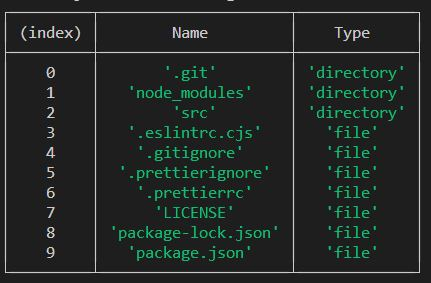

# Assignment: File Manager

## Description

Your task is to implement File Manager using Node.js APIs.

The file manager should be able to do the following:

- Work using CLI
- Perform basic file operations (copy, move, delete, rename, etc.)
- Utilize Streams API
- Get information about the host machine operating system
- Perform hash calculations
- Compress and decompress files

## Technical requirements

- No external dependencies should be required
- Use 18 LTS version of Node.js
- The program is started by npm-script `start` in following way:
```bash
npm run start -- --username=your_username
```
- After starting the program displays the following text in the console (`Username` is equal to value that was passed on application start in `--username` CLI argument)  
`Welcome to the File Manager, Username!`  
- After program work finished (`ctrl + c` pressed or user sent `.exit` command into console) the program displays the following text in the console  
`Thank you for using File Manager, Username, goodbye!`  
- At the start of the program and after each end of input/operation current working directory should be printed in following way:  
`You are currently in path_to_working_directory`  
- Starting working directory is current user's home directory (for example, on Windows it's something like `system_drive/Users/Username`)
- By default program should prompt user in console to print commands and wait for results  
- In case of unknown operation or invalid input (missing mandatory arguments, wrong data in arguments, etc.) `Invalid input` message should be shown and user should be able to enter another command
- In case of error during execution of operation `Operation failed` message should be shown and user should be able to enter another command (e.g. attempt to perform an operation on a non-existent file or work on a non-existent path should result in the operation fail)
- User can't go upper than root directory (e.g. on Windows it's current local drive root). If user tries to do so, current working directory doesn't change  

List of operations and their syntax:
- Navigation & working directory (nwd)
    - Go upper from current directory (when you are in the root folder this operation shouldn't change working directory)  
    ```bash
    up
    ```
    - Go to dedicated folder from current directory (`path_to_directory` can be relative or absolute)
    ```bash
    cd path_to_directory
    ```
    - Print in console list of all files and folders in current directory. List should contain:
        - list should contain files and folder names (for files - with extension)
        - folders and files are sorted in alphabetical order ascending, but list of folders goes first
        - type of directory content should be marked explicitly (e.g. as a corresponding column value)
    ```bash
    ls
    ```
    Example of how `ls` command output may look like  
      
- Basic operations with files
    - Read file and print it's content in console (should be done using Readable stream): 
    ```bash
    cat path_to_file
    ```
    - Create empty file in current working directory: 
    ```bash
    add new_file_name
    ```
    - Rename file (content should remain unchanged): 
    ```bash
    rn path_to_file new_filename
    ```
    - Copy file (should be done using Readable and Writable streams): 
    ```bash
    cp path_to_file path_to_new_directory
    ```
    - Move file (same as copy but initial file is deleted, copying part should be done using Readable and Writable streams): 
    ```bash
    mv path_to_file path_to_new_directory
    ```
    - Delete file: 
    ```bash
    rm path_to_file
    ```
- Operating system info (prints following information in console)
    - Get EOL (default system End-Of-Line) and print it to console  
    ```bash
    os --EOL
    ```
    - Get host machine CPUs info (overall amount of CPUS plus model and clock rate (in GHz) for each of them) and print it to console  
    ```bash
    os --cpus
    ```
    - Get home directory and print it to console  
    ```bash
    os --homedir
    ```
    - Get current *system user name* (Do not confuse with the username that is set when the application starts) and print it to console  
    ```bash
    os --username
    ```
    - Get CPU architecture for which Node.js binary has compiled and print it to console  
    ```bash
    os --architecture
    ```
- Hash calculation  
    - Calculate hash for file and print it into console  
    ```bash
    hash path_to_file
    ```
- Compress and decompress operations  
    - Compress file (using Brotli algorithm, should be done using Streams API)  
    ```bash
    compress path_to_file path_to_destination
    ```
    - Decompress file (using Brotli algorithm, should be done using Streams API)  
    ```bash
    decompress path_to_file path_to_destination
    ```  
    NB! After decompressing of previously compressed file result should not differ with originally compressed file
    
